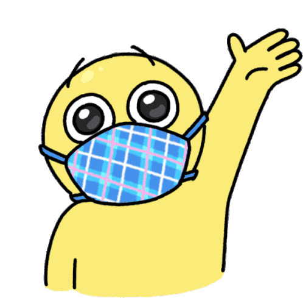

<h1 align="center"> I'm happy to see you here!</h1>


```javascript
const whoAmI = {
  name: "Peterson Maciel Matias",
  age: 33,
  graduation: "Graduated in Systems Analysis and Development",
  currentCourse: "Rocketseat",
  currentCity: "Varginha/MG",
  ambitions: [
    "Getting my first job as a Front-End dev",
    "Build my own house",
    "Impacting the world through technology",
    "Be happy"
  ]
}
```
<br>
<div align="center">
  <h2>Languages and Tech Studied</h2>
    
    
    
    
 
  <br>
<div align="left">
  <h2>👨🏽‍🦲 &nbsp;Social Links</h2>

<p align="left" style="background:yellow">

<a href="www.linkedin.com/in/peterson-matias-1a6829211" target="_blank">
  
</a>
<a href="https://www.instagram.com/peterson.pna/" target="_blank">
 
</a>
<a href="https://pmacielmatias@gmail.com" target="_blank">
 
</a>
</p>
</div>

<!--
**petersonmaciel/petersonmaciel** is a ✨ _special_ ✨ repository because its `README.md` (this file) appears on your GitHub profile.
Here are some ideas to get you started:
- 🔭 I’m currently working on ...
- 🌱 I’m currently learning ...
- 👯 I’m looking to collaborate on ...
- 🤔 I’m looking for help with ...
- 💬 Ask me about ...
- 📫 How to reach me: ...
- 😄 Pronouns: ...
- ⚡ Fun fact: ...
-->
